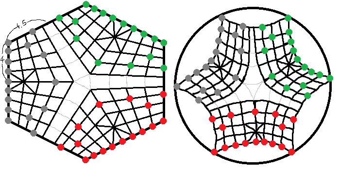

# Chinese Chess

Need Statement: People learning chess need a way to practice their skills while enjoying the process.

Gap Analysis

other homework stuff in bioe400

AI Coach that explains the purpose of moves.

Powerful engines to analyze the best moves. (Currently they are very hard to understand)

# Part I - Chinese Chess GUI

## Target Usages
- play with opponents
- play with bot
- bot vs bot tests
- game analysis (could display multiple boards)
- sandbox (for defining the starting position)

## Designed Features

### Boards

*you need to add the game element to the page for the methods to work.*

Original layout

1. back layer:
    - board size: 9sq (width) x 10sq (height)
    - margin size: 6% each side (30px (left/right) 27px (top/bottom))
    - background: adjustable
    - border radius: 0.1sq
    - shadow: 7px 7px 5px burlywood
    - border: 3px ridge burlywood
2. 1st layer:
    - grid & lighting: centered in the background
3. 2nd layer: squares
    - one square in each square space
4. 3rd layer: pieces
    - pieces move by changing the transform attribute.
5. 4nd layer: effects
    - effects are in the center. However, check needs to be positioned in the checked team's territory.

#### Necessary methods
1. initializing (constructor): add the pieces based on fen
2. get boardElement: acquire the HTML element of the game with the original layout.
1. changing styles
    - 3D (three.js)
    - Basic (vanilla HTML)
2. changing the look of board
    - whiteoak
    - darkoak
    - simple (bleachedalmond)
2. changing the look of pieces
    - whiteoak
    - darkoak (in that case team-2 uses darkgoldenrod)
    - simple
    - (hopefully) fake 3D
2. changing fonts of pieces
    - weibei魏碑
    - xingkai行楷
    - lishu隶书
    - yankai颜楷
    - western
    - western2
    
3. changing perspectives
    - team 1 view
    - team 2 view
4. display illustration
    - arrows: should be a the legal moves from any pieces
    - should be above all pieces, below effects
7. change permission: Only the permitted team's pieces are allowed to interact with you. You can change to permit some specific team (in a match), all teams (when you are in sandbox mode), or no team at all (when the game ends).

7. click control

    1. original state

        none of the squares respond to hover or clicks. Only the pieces that you are allowed to select would respond to clicks (when you hover over them the cursor turns to finger). Other pieces are not respondent to hover or clicks.

    1. select a piece

        Click on a selectable piece to select it. When a piece is selected, the piece raises itself and tilts slightly. All semilegal positions (moves allowed in standard moving rule) will be shown.

    2. deselecting a piece

        when the selected piece is clicked again, it will be deselected. The marks for available moves are removed, and the board goes back to the original state.

    3. selecting another piece

        When you already have some pieces selected, clicking on another selectable piece will change your selection. The display will change so that only the new selected piece will be tilted. The marks will be changed to the available moves for the new piece.

    2. failing to move a piece

        when an unavailable square/piece is clicked, the board displays a failed move.

        when an available square/piece is clicked, the board will check again the availability of that square (in case someone cheated by changing the square/piece to available). If the check failed, a failed move is displayed.

    3. suicide moves

        If the square/piece clicked is available and and check passed, the Rule checks again if that move is not a suicide (a move that leads to the capture of your king on the next turn). If that check fails, a failed move is displayed and a suicide warning is shown (based on the BitBoard from Rule).

    3. successful moves

        If the suicide check passed, the move is played. This played move will be marked. Then, based on the property of the move (decided by Rule), the board plays the capture/check/mate animation. If a move covers more than one of those effects, the highest priority type will be shown: mate > check > capture. After that, the board returns to the original state.

    4. aborting (when the game ends with accepted draw requests/resign)

        selected pieces are put down. Available square marks are removed. Pieces/squares in animation will get their animation removed. Effects are hidden. For failed moves, pieces teleport to the starting point. For normal moves, pieces teleport to the ending point.

8. drag control

        distinguishing drag and clicks: if the click is longer than 0.5s (mouseup not fired 0.5s after mousedown), we treat that as drag.

    1. original state

        Only pieces that can be selected can respond to drags.

    1. dragging a piece

        When you start dragging, all other selected pieces will be unselected and all marks for available moves will be erased. The dragged piece turns big and starts to follow your cursor, staying still relative to your cursor. However it cannot go outside of the board background (its x and y coordinates will be clipped). The cursor becomes a hand.

    2. failing to move a piece

        Failure happens when the drag ends (mouseup) and

        - the piece is not in any of the squares
        - the piece is in an unavailable square
        - the piece is in an available square but the check failed

        Then the board displays a failed move and auto-selects the piece.

    3. suicide moves

        When the drag ends, the piece is in an available square and the check passed, the Rule checks again if that move is not a suicide (a move that leads to the capture of your king on the next turn). If that check fails, a failed move is displayed and a suicide warning is shown (based on the BitBoard from Rule).

    3. successful moves

        If the suicide check passed, the move is played. This played move will be marked. Then, based on the property of the move (decided by Rule), the board plays the capture/check/mate animation. If a move covers more than one of those effects, the highest priority type will be shown: mate > check > capture. After that, the board returns to the original state.

    4. aborting (when the game ends with accepted draw requests/resign)

        selected pieces are put down. Available square marks are removed. Pieces/squares in animation will get their animation removed. Effects are hidden. For dragging pieces, pieces teleport to where they started to be dragged. For failed moves, pieces teleport to the starting point. For normal moves, pieces teleport to the ending point.

9. (async) request a move from a team

    this method will return a promise, resolved with the move and the MoveState (from Rule) when a move has been made by the requested team.

#### Critical Components

1. sound display (could be turned off)

    - capture
    - check
    - mate
    - draw

6. mark played move
    - staring position mark
    - ending position mark
8. display successful move: move from the piece's current position to the target position. The animation takes 0.3s. When the animation is playing, they should not interact with the user.
9. display failed move:

    (for a normal piece) the piece moves from the target position and bounces back. Both animations take 0.05s.

    (for a currently dragging piece) the piece bounces back to the original position. This takes 0.05s.
    When the animation is playing, they should not interact with the user.

1. display suicide warning: all squares in specified positions will flash red once in 1s. You can specify more than 1 squares to flash.

2. capture/check/mate display:

    - An animation appears at the center of the board and disappears when it finishes.
    The animations consists of a background and characters. The background spreads at the beginning (from high blur, low scale) to the normal display state, and then diffuses out (high blur, high scale). The characters drops onto the background (high blur, very high scale), and then diffuses out.

    |  Event  | Background |  Characters  | Character Position | Notes |
    | ------- | ---------- | -------------| ------------------ | ----- |
    | capture |  ink ring  |     "吃"     |     center         |   -   |
    |  check  |  ink dot   |    "将军"    | left-top and right-bottom | - |
    |   mate  | ink splash |    "绝杀"    | left and right, with the left slightly higher | char also move away from each other |

3. display failed teams:

    - its king gets dark
    - the whole team gets dark

7. show available/non-available moves

    - all squares and pieces will be either available or nonavailable
    - squares and pieces in semilegal positions will be marked with a green dot
    - available squares turn green when hovered; available pieces turn cursor to finger
    - unavailable squares turn red when hovered; unavailable pieces does not respond to hover
    - if this option is turned off: the squares and pieces will not be marked; all pieces turn cursor to finger when hovered, all squares turn white when hovered.

#### Variations
There is only 1 board type.

### Rules
The Rule keeps track with the game (current position, current player, played moves) and decides if a move is allowed in the current situation.

How Rule notes moves and positions: "H0G2" (meaning a piece moved from H0 to G2). All outputs from Rule about moves are like this.

<pre>
９車馬象士將士象馬車
８　　　　　　　　　
７　砲　　　　　砲　
６卒　卒　卒　卒　卒
５　　　　　　　　　
４　　　　　　　　　
３兵　兵　兵　兵　兵
２　炮　　　　　炮　
１　　　　　　　　　
０俥傌相仕帥仕相傌俥
　ＡＢＣＤＥＦＧＨＩ
</pre>

How the board notes the availability throughout the board: BitBoard. This is a 90-bit data structure, each bit corresponding to a square. The bits are marked from left to right, and from top to bottom (ie, the top 1-9 bits are for the top row, the top 10-18 bits are for the second, etc.). For each position, if some condition is met for that square, the bit is 1, otherwise it is 0.

#### Necessary Methods

1. Initializing based on fen and moves
1. get playedMoves: gives all moves that have been played.
1. Give all allowed moves from a position with the current layout. The starting position should contain a piece. Returns a BitBoard marking available moves.
1. Give all attackers for the king if some move is played with the current layout. This is for detecting suicides. Returns a BitBoard marking all the pieces that can capture your king in the immediate next turn.
1. Give the property of a move. Checks if the move is a capture, check or mate. Returns a JSON with fields "capture", "check", "mate" holding boolean values.
1. making a move. Keep track of the game here, and check if any cycling rule, auto draw, or 60 Moves Rule should be triggered. Returns a MoveState, which is a JSON object with field `"winner"` holding a number and `"message"` holding a `string`. `winner` is `-1` for ongoing games, `0` for draw and `1`/`2` for red/black team. If any of these rules are triggered, returns the winner and the reason. If cycling/60 Moves is about to be triggered, a warning message is returned. \[About to be triggered = the exact / counted moves reaches at least 57\]

| Rule | Reason |
| ---- | ------ |
| cycling | "{red loses/black loses/the game ends with draw} because {the Asian rule type that applies}" "{长捉/长将/允许循环}对{长捉/长将/允许循环}，{红方判负/黑方判负/判和}" |
| auto draw detection | "{单炮对{单/双}象/双方无可过河子力}必和，游戏结束" |
| 60 Move Rule | "60回合限招后求和，游戏结束" |

| Rule | When to warn | Content |
| ---- | ------------ | ------- |
| cycling | the exact same layout appears for the 2nd time | "If this layout appears one more time, {red loses/black loses/the game ends with draw} because {the Asian rule type that applies}" |
| 60 Move Rule | counted moves reaches exactly 57 | "60 Move Rule about to apply" |

#### Critical Components
1. Standard Moving Rules

    - rook車 moves any number of units in straight lines. Cannot move over other pieces
    - knight馬 moves like an L shape (consists of 1 unit straight and then 1 unit diagonally). Will be blocked if the square after the first 1-unit straight move is occupied by any piece
    - cannon炮 moves any number of units in straight lines. When capturing, it must move over 1 piece from any team.
    - elephant相象 moves 2 units diagonally (consists of 1 unit diagonal move and then another in the same direction). Will be blocked if the square after the first 1 unit diagonal move is occupied by any piece. Cannot cross the river.
    - guard仕士 moves 1 unit diagonally. Cannot move out of the palace.
    - king帥將 moves 1 unit straight. Cannot move out of the palace. However, if the king can see the opponent's king (on the same file without block in between), it may capture the other king.
    - pawn兵卒 moves 1 unit forward before it crosses the river. After it crosses the river, it can also move 1 unit to the left or the right.

2. Cycling Rules

    Sometimes the game will end up in endless cycles. However, taking them all as draws is arbitrary as sometimes it is clear which side is under attack. The rules for tackling cycles has not been standardized. If a cycle has repeated itself three times, there are several major systems for deciding which team takes the win.

        - [Chinese Rule](https://www.xqipu.com/node/94985): It is used in the formal competitions in China. The most up-to-date version was produced in 2020. It is very complicated, designed to reduce draws and ensure interesting games. Unfortunately, currently Chinese rule is ambiguous. In contests, the usage of this rule highly depends on the understanding of specific referees.
        - [Asian Rule](https://www.xqbase.com/protocol/rule_asian.htm) (World rule): A simpler, clearer and unambiguous version of Chinese rule, though probably less interesting. Almost all online cchess platforms right now use asian rules.

3. Automatic Draw Determination

    When the position is proven to end up in a draw (that is, neither team has any means to win), the rule will immediately end the game with a draw. An obvious example is **when neither team has any pieces that can cross the river**. There are some other cases that is rigorously unwinnable, which are all listed in a [Pikafish website](https://www.pikafish.com/wiki/index.php?title=%E8%87%AA%E5%8A%A8%E5%88%A4%E5%92%8C):

    - 1炮 vs 1士`n`象 (where `n = 0,1,2`, same below unless noted)
    - 1炮`n`相 vs `n`象
    - 1炮 vs 1炮

    *Note: technically speaking these cases could be won by overtime*

    These cases could be won, but *only* via mate in 1. So if the engine knows how to avoid that (there is always a safe move that does not lead to mates), these cases could also be automatically determined as draws:

    - 1炮 vs 2士`n`象
    - 1炮`m`相 vs 1士`n`象 (where `m>0`)
    - 1炮`m`象 vs 1炮`n`象 (where `m,n = 0,1,2` and `m,n` are not both `0`)

4. the 60 Moves Rule
    This is similar to the 50 Moves Rule in chess. If each player has made 60 consecutive moves without any captures (checks will only be counted 10 times for this purpose), a draw request will be automatically granted.

#### Variants
1. Standard CChess
    Standard Moving Rules, Notify checks, Disallow suicide, Win by mates, Automatic draw determination, Asian rule for cycles
2. Simplified CChess for New Learners
    Standard Moving Rules, Does not notify checks, Allow suicide, Win by capturing the king

**For the following variants, mate determination will be planed to be implemented. Though it might be pretty interesting to think about how to do that. Thus, suicide would be allowed. Only 60 Move Rule will be applied for automatic draw determination. Cycling rules will not be considered. If a cycle triple repeats itself, the game could end up in draw immediately or the game simply doesn't care.**

3. Revealer chess揭棋 (I hope this one has mate detection)

    Start with the original position, except that all the pieces except the king have their positions randomized and flipped upside down. The king must be revealed and sit at the standard starting position. Unrevealed pieces move like whatever piece that should be at that position in standard start game. After it is moved, it reveals itself and then moves like standard cchess pieces. In this mode, elephants and guards can cross the river and move outside of palace. Pawns only move forward if they are behind the river and can also move left/right when they are in front of the river.

4. Double Step双步

    You may move twice in your turn! However, if you choose to move twice, you must not capture. If you do not capture, you must move twice. Win when you capture the opponent's king.

4. Red-eyed Chess暴走

    You can capture your allies if necessary! Much less likely to lose from stalemate.

5. Stone Chess石头棋 (inspired by duck chess from chess)

    A stone appears on the board! The stone can move to any vacant squares on the board, but it cannot capture or be captured. After each turn, the player must move the stone to another square.

6. ~~Three Players三人象棋~~

    Deleted b/c too much work and not potentially attractive. The board looks awkward. You need to specifically make a board and redesign the animations for this game. You need to rewrite the rules. Internally it requires a brand new way to represent the board. You need 3 players (maybe you train a model for that?).

    This game allows 3 players. The board is warped so that each player faces the other two teams like this: 

    You go along the gridlines. Thing is when you are at the center of the board, there are 2 branches you can go to. The capturer of the king of some team will become a king and can control that team's pieces. (Or, if the king died, all the pieces of that team can no longer be moved. They can still be captured.)

    Notify checks (that is, when an opponent's piece can move to a king's place), allow suicide, win by capturing all opponent's king.

### Match

Match reflects the status of Game. Shows the `Board` of your perspective.

layout:
? (I need board+request overlay, name, avatar, remaining time, their captured pieces, recall/draw/resign button, played moves, message board, option menu.)

1. left space: a container holding the Board. A hidden overlay that appears with a message or a request.
2. right space: a container holding the timer

#### Necessary Methods
1. initializer to prepare the board and the timers (time acquired from Game).
1. get matchElement - acquire the HTML element of the match for a given team
2. shows a given message.
3. shows a given request. There is a accept and a deny button (text and function can be specified). The deny button will be auto activated after 10s. A request will not affect the timer for either side.
4. activate the timer of a given team. When this happens, the other team's timer will be paused.

5. request recall

    - You can request at any time.
    - You cannot make new requests if you have requested 5 (number can be specified) times.
    - If the request is denied you cannot make more requests this turn.
    - If the option is not available, the button will be disabled. The number of remaining requests should be shown on the button.

5. request draw

    - This option is only available after 5 rounds.
    - You cannot make new requests if you have requested 2 more times than your opponent.
    - If the request is denied you cannot make more requests this turn.
    - If the option is not available, the button will be disabled. The number of remaining requests should be shown on the button.
    - If the request is granted, the game ends instantly with a draw. If not, game continues.

6. resign

    - This button is disabled for the first 5 rounds of game.
    - When you click it, a confirmation request is displayed when you click the resign button.
    - After you confirm, the game ends with your opponent winning.

9. start the game:

    The board is prepared with the layout from fen. Then the turns begins, with the team at the current turn starts first.

    A turn: the timer is activated. A successful move from the board is requested. After Match received the move, it will be played. If the timer runs out of time, it throws an error. After you made your move, your timer gains extra time (depending on setting). When the AI gives its choice, the board will be updated. This move will be recorded on the screen with rank notation (馬八进七/馬８进７).

    Error catchers will catch the error and the current team loses the game.

#### Critical Components

#### Variants

**The following varients does not require internet**

1. Game with AI

    - Recall, Draw, Resign buttons are available. Bots will never request to recall, draw or resign.
    - If the resign button is clicked, Match aborts the request for the current player and the game ends.
    - If the draw button is clicked, it will let the bot check its rating. If the bot thinks it is in advantage, the request will be refused. If not, it would accept it.
    - If the recall button is clicked, the request will be granted. The game reverts itself when you made your last move.

4. AI vs AI

    The board asks the two AI for moves. No need to process recall/draw/resign.

2. Record a game (pieces of both teams could be operated by me)

    - the board gives all moves.
    - no timer
    - no recall/draw/resign
    - record branches
    - you can go back and forth
    - you can click a move on the record and the board will show the layout right after that move

**The following needs a connection with the server**

1. Game with human opponent

    At the start of the game, ask the server for the name, avatar, remaining time and captured pieces.
    Interact with the server to recall move (could turn off/set available times), request draws, resign.
    Listen to the server for recall, draw, resign, recall req, draw req separately.
    - Board: could only operate my side; opponent's pieces move automatically
    - Rule: Standard/Simplified/Revealer/Double Step/Stone/~~Three Player~~

2. Spectator

    - Same with game with some opponent, but you cannot interact with any piece on the board. No recall/request draw/resign button shown.
    - Listen to the server for recall, draw, resign.

## More ambitions

You only have 5 recalls and 3 draws (Specific number should be open to change via `Match`'s `constructor`). Every time a request is made, the remaining number should be reduced regardless of its result. If you have used up your requests, the button should be disabled and its `EventListener` removed.

add disappear animation for message and request, especially request so you know what you clicked

Use react to rewrite this program. Benefits:
- easier to maintain as the HTMLs could be in TSX
- Method components and Hooks could do all that classes and inheritance can do, and it is the future direction
- Prepares the project for further development like server connections.

Building a server. First step is to build a local server, so people can type in a room number and get connected. You may choose to join as spectators or players. The game starts only when there are two players ready. Players joining after the game starts will wait in lines. Later, the server also hosts your name, avatar, played games and records collection.

*Note: The server will validate the move internally and throw an error if the move is wrong. This is to prevent someone cheating by changing their js file locally to send illegal moves.*

## References
- wooden background: https://www.postermywall.com/
- red wood: https://tietu.3d66.com/reshtmla/tietu/items/0a/0ay4a3Semyj6vHN.html
- capture/check/mate effects: https://izihun.com/art-edit/yishu.html, https://ch.pinterest.com/pin/920212136330868286/, https://ch.pinterest.com/pin/838725130602411946/, https://ch.pinterest.com/pin/millions-of-png-images-backgrounds-and-vectors-for-free-download--857724691558496994/, https://www.lzltool.cn/Toolkit/BatchChangePngColor, https://www.freeconvert.com/png-to-svg. Details at `/utils/archive/source.txt`
- Sounds: https://freesound.org/people/Kriaa/sounds/348835/ and https://freesound.org/people/BiancaBothaPure/sounds/437484/
- fonts: see `/utils/copyright-fonts/acknowledgement.txt`

# Part II - Creating a Bot for CChess
What are current solutions for CChess AI? [Traditional](https://www.pikafish.com/wiki/index.php?title=%E4%BB%80%E4%B9%88%E6%98%AF%E2%80%9C%E8%AF%84%E4%BC%B0%E2%80%9D%EF%BC%9F), [NNUE](https://www.pikafish.com/wiki/index.php?title=%E4%BB%80%E4%B9%88%E6%98%AF%E2%80%9CNNUE%E2%80%9D%EF%BC%9F), [AlphaGo-like](https://www.pikafish.com/wiki/index.php?title=%E8%B1%A1%E6%A3%8B%E6%9C%89%E2%80%9C%E9%98%BF%E5%B0%94%E6%B3%95%E7%8B%97%E2%80%9D%E5%90%97%EF%BC%9F)

[Creating AlphaGo-like engines](https://zhuanlan.zhihu.com/p/24801451)

Can I use CNN to do this?

Can I use Decision Tree Model to do this?

For additional info, look for some papers.

## Relevant Links
- [Chinese Chess Wikipedia](https://www.xqbase.com/)(Chinese)
- [Pikafish](https://www.pikafish.com/)(Chinese), the currently most powerful free cchess engine using NNUE
- [Pikafish CChess Software Wiki](https://www.pikafish.com/wiki/index.php?title=%E6%A3%8B%E8%BD%AF%E7%9F%A5%E8%AF%86)(Chinese)
- [Pikafish rules](https://www.pikafish.com/rule.html)(Chinese), simplified computer-friendly rules derived from asian rules that is used by Pikafish.
- [px0](https://px0.org/), an engine that uses the technique of AlphaGo